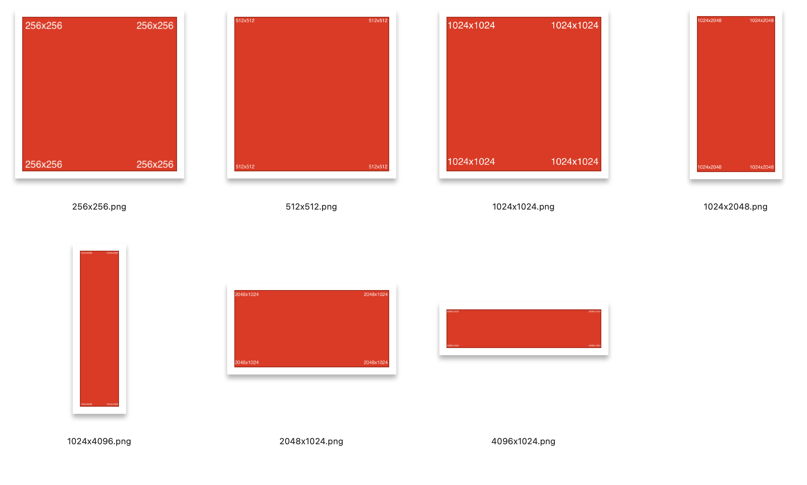

# UnitImages

A collection of images with well-defined sizes to test UI layouts.

## Motivation

I work on UI layouts on various platforms. I often need to have a set of images with well-defined sizes to test UI layouts. The images need to stretch the capabilities of the systems that I am working on. Does the system behave well with all portrait and landscape layouts? How about aspect ratios: square, tall, wide, etc?

## Implementation

The UnitImages repo aims to provide a collection of images with well-defined sizes to test UI layouts. For easy debugging and visual inspection, the images have their sizes represented in text in each of the four corners.

The images are in PNG format that in 2024 is ubiquitous and convertable to any other format if needed.
